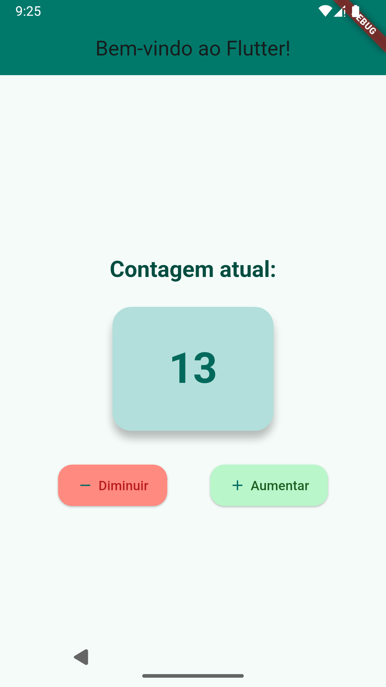

# Flutter Counter App 🚀

Este é um aplicativo simples construído em Flutter que apresenta uma interface elegante e funcional para aumentar e diminuir um contador. Ideal para aprender e experimentar os conceitos básicos de Flutter. 😄

## 📸 Captura de Tela



## 🛠️ Funcionalidades

- **Exibição do contador:** O número atual do contador é mostrado no centro da tela.
- **Botões de controle:**
  - Botão para **aumentar** o contador.
  - Botão para **diminuir** o contador.
- **Interface moderna e organizada:**
  - Paleta de cores suaves e harmoniosas.
  - Elementos com bordas arredondadas e espaçamento bem planejado.

## 🎨 Design

- **Paleta de cores:** Tons de verde-água (teal) e cores pastéis para um visual agradável.
- **Botões:** Com ícones e rótulos, organizados em uma linha para fácil interação.
- **Responsividade:** Design centralizado com espaçamento proporcional.

## 🚀 Como executar o projeto

### Pré-requisitos

- **Flutter SDK** instalado na sua máquina.
- Um editor de código como o [VS Code](https://code.visualstudio.com/) ou [Android Studio](https://developer.android.com/studio).
- Um dispositivo físico ou emulador para testar o app.

### Passos

1. Clone este repositório:
   ```bash
   git clone https://github.com/Nivaldo-Nilngn/meuappflutter.git
   ```

2. Navegue até o diretório do projeto:
   ```bash
   cd meuappflutter
   ```

3. Instale as dependências:
   ```bash
   flutter pub get
   ```

4. Execute o app:
   ```bash
   flutter run
   ```

## 📂 Estrutura do Projeto

```plaintext
lib/
├── main.dart           # Arquivo principal do app
```

## ✨ Tecnologias Utilizadas

- **Flutter**: Framework para desenvolvimento multiplataforma.
- **Dart**: Linguagem de programação do Flutter.

## 📚 Aprendizados

Este projeto foca nos seguintes conceitos básicos do Flutter:

- Uso de widgets como `Scaffold`, `AppBar`, `Column`, e `Card`.
- Gerenciamento de estado com `setState`.
- Personalização de temas e widgets.

## 🤝 Contribuições

Contribuições são bem-vindas! Sinta-se à vontade para abrir uma issue ou enviar um pull request. 😃

## 📜 Licença

Este projeto está licenciado sob a [MIT License](LICENSE).

---

### 📧 Contato

Se tiver dúvidas ou sugestões, entre em contato:

- **Email:** [nivaldo.nilngn@gmail.com](mailto:nivaldo.nilngn@gmail.com)
- **LinkedIn:** [Seu Perfil](https://www.linkedin.com/in/nivaldo-nilngn/)

---

💙 Obrigado por conferir este projeto! 😊
